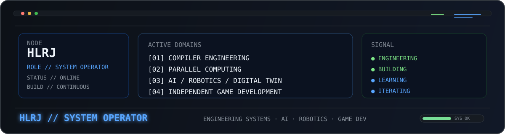

<div align="center">
  
</div>

```console
HLRJ@github:~$ whoami
> Software Engineer / System Builder
> Compiler · Parallel Computing · Cybersecurity · AI/Robotics · Indie Game Dev
```

## `FOCUS`

`Compiler / LLVM / C++` · `Parallel Computing` · `Cybersecurity` · `AI / RAG / Robotics` · `Digital Twin` · `Godot / Blender`

## `ARSENAL`

<div align="center">


</div>

<div align="center">

`BUILD SYSTEMS · LEARN DEEPLY · SHIP THINGS`

</div>
